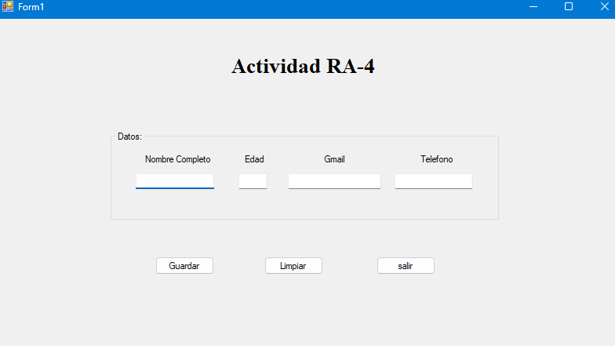
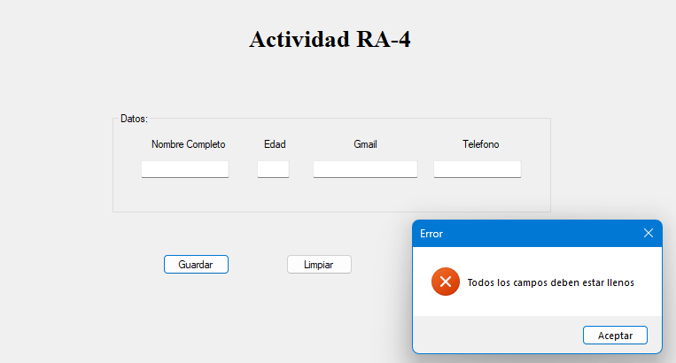
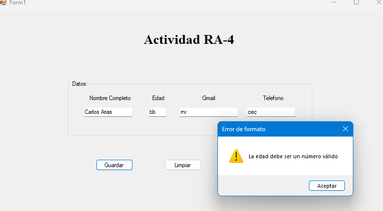
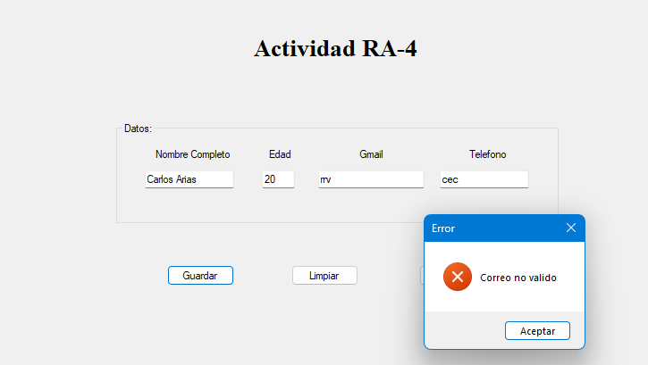
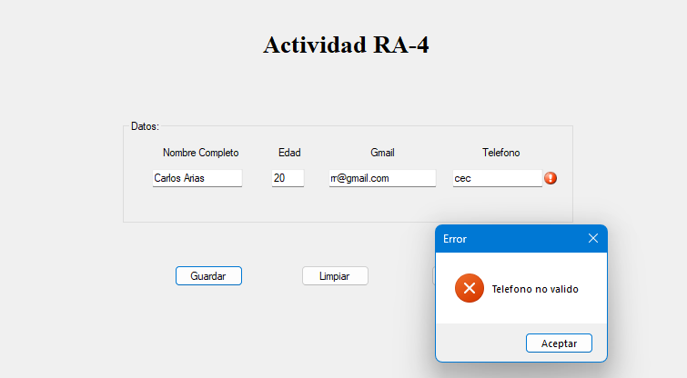
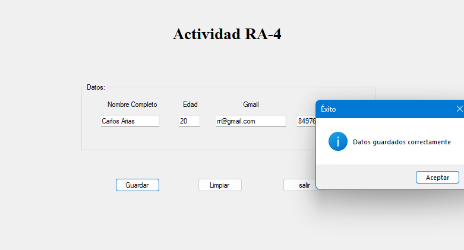
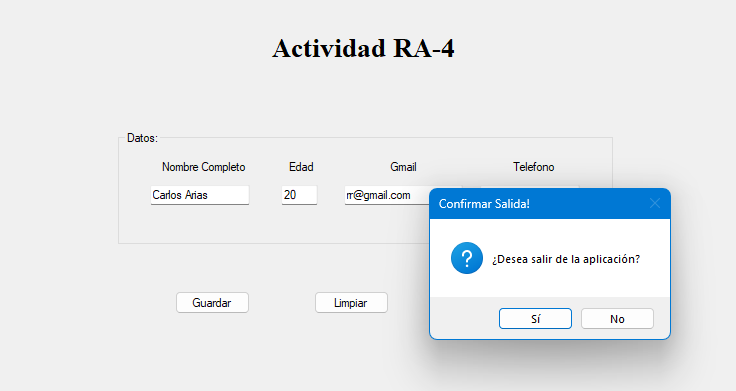

<h1 align="center"><b>Bienvenidos a este Portafolio</b></h1>

Este es un sistema de prueba, para aprender a usar el "try-catch" y "Errorprovier"correctamente.

 
<h3>Datos del estudiante:<h3/>
<ul>
  <li>Oscar David Mota Reyes</li>
  <li>#13 de la lista</li>
  <li>5to D-2</li>
</ul>
 
  <h3>Datos de entrada del sistema:</h3>
<ul>
  <li>Nombre</li>
  <li>Edad</li>
  <li>Gmail</li>
  <li>Numero telefonico</li>
</ul>
 
  <h3>Datos de salida del sistema:</h3>
<ul>
  <li>Mensajes de alertas</li>
</ul>
 
<h3>Anexos:</h3>
  
<h4>-Inicio</h4>

 
<h4>-Validaciones con try-cath:</h4>
<h5>-Campos vacios:</h5>

 
<h5>-Edad no valida:</h5>

 
<h5>-Gmail no valido:</h5>

 
<h5>-Telefono no valido:</h5>

 
<h5>-Todo Correcto:</h5>

 
<h5>-Para salir:</h5>

## <b>Gracias por visitar este portafolio</b>

